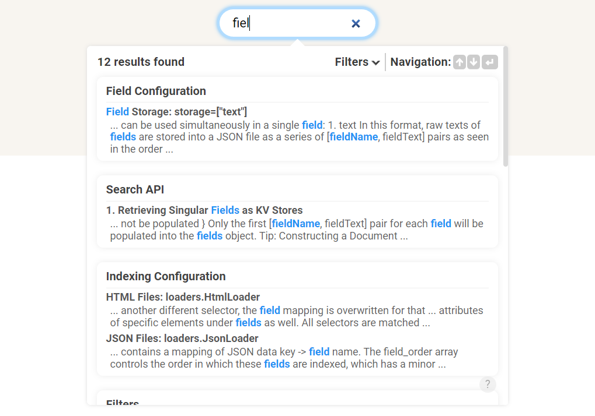

# InfiSearch


Easy, relevant, and efficient client-side search for static sites.

## Description

InfiSearch is a client-side search solution made for static sites, depending on a pre-built index generated by a CLI tool.



## Features

- **Relevant Search** 🔍: spelling correction, automatic prefix search, boolean and phrase queries, BM25 scoring, proximity scoring, and more...
- **Speedy** 🏇: WebAssembly & WebWorker powered, enabling efficient, non-blocking query processing. Also includes persistent caching to minimize network requests, and a multi-threaded  CLI indexer powered by Rust.
- **Semi-Scalable**, achieved by optionally splitting the index into tiny morsels, complete with incremental indexing.
- A **customisable**, **accessible** [user interface](https://infi-search.com/infisearch/search_configuration_styling.html) 🖥️
- Support for **multiple file formats** (`.json,csv,pdf,html`) to satisfy more custom data requirements.

## Getting Started

Powering static site search with InfiSearch is extremely easy, and requires just a folder of your HTML files — titles, headings, and other text are automatically extracted. Links to your pages are automatically generated based on your folder structure, but can also be manually specified.

### 1. Installing the indexer

If you have the rust / cargo toolchains setup, simply run `cargo install infisearch --vers 0.8.5`.

Alternatively, download the cli binaries [here](https://github.com/ang-zeyu/infisearch/releases).

### 2. Running the indexer

Run the executable as such, replacing `<source-folder-path>` with the relative or absolute folder path of your source html files, and `<output-folder-path>` with your desired index output folder.

```
infisearch <source-folder-path> <output-folder-path>
```

### 3. Installing the Search UI via CDN

Add the following resources to your pages:

```html
<!--  Search UI script -->
<script src="https://cdn.jsdelivr.net/gh/ang-zeyu/infisearch@v0.8.5/packages/search-ui/dist/search-ui.ascii.bundle.js"></script>
<!-- Search UI css, this provides some basic styling for the search dropdown, and can be omitted if desired -->
<link rel="stylesheet" href="https://cdn.jsdelivr.net/gh/ang-zeyu/infisearch@v0.8.5/packages/search-ui/dist/search-ui-light.css" />
```

If you wish to host the files, you can find them in the `<output-folder-path>/assets` directory generated by the indexer, or in the [releases](https://github.com/ang-zeyu/infisearch/releases) page.

### 4. UI Initialisation

Give any `<input>` element in your page an `id` of `infi-search`, then call:

```js
infisearch.init({
  searcherOptions: {
    // Output folder URL specified as the second parameter in the cli command
    // URLs like '/output/' will work as well
    url: 'http://<your-domain>/output/',
  },
  uiOptions: {
    // Input folder URL specified as the first parameter in the cli command
    // This is where the generated result preview links will point to,
    // and where you host your site.
    sourceFilesUrl: 'http://<your-domain>/source/',
  }
});
```

## Documentation

The user guide, which also uses InfiSearch for its search function, can be found [here](https://infi-search.com/infisearch/getting_started.html).

Check out the [website](https://infi-search.com) and [medium article](https://medium.com/@angzeyu/easy-relevant-and-semi-scalable-static-site-search-with-morsels-bc9315c5a2c2) as well!

## License

This project is [MIT licensed](./LICENSE.md).
