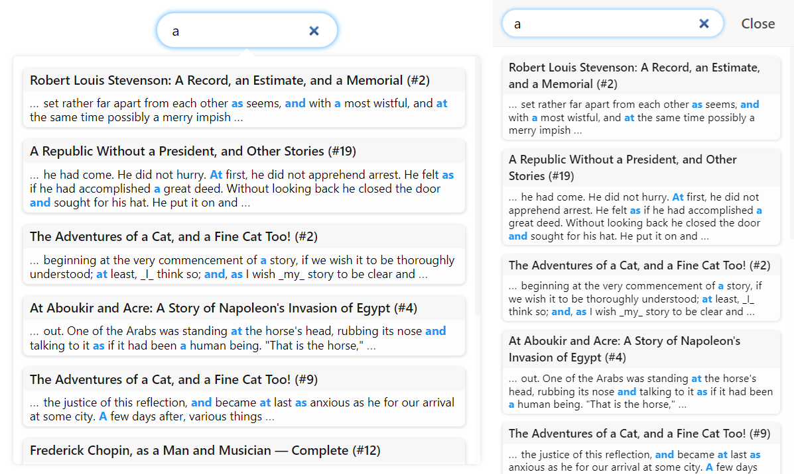

# Morsels.`j/rs`


Easy, precise, and efficient client-side search for static sites.

## Description

Morsels is a complete client-side search solution tailored for static sites, including a search *user interface and library* that depends on a *pre-built index* generated by a *command-line* tool.



## Features

- **Multi-threaded** 🏇 CLI indexer powered by Rust
- **Typo tolerance** ⌨ with spelling correction and automatic prefix search
- **Feature-rich search** 🔍: boolean queries, field filters, phrase queries, BM25 scoring, query term proximity boosts, persistent caching and WebWorker built-in
- Powered by **WebAssembly**, enabling efficient index (de)compression and query processing 
- **Semi-Scalable** 📈, achieved by (optionally) splitting the index into chunks ("morsels").
- **Incremental** Indexing
- **Customisable** and **Accessible** dropdown / fullscreen popup user [interface](https://morsels-search.com/morsels/search_configuration_styling.html) 🖥️


## Use Cases

Morsels' aim is to provide an easy to set up, yet feature-rich, and efficient search solution for static sites and/or static site generators.

The indexing tool supports a few other file formats (`.json`, `.csv`, `.pdf`, `.html`) as well, which can help support more custom data requirements (e.g. linking to another domain).

Check out the demo at https://morsels-search.com!


## Documentation

The documentation, which also uses Morsels for its search function,  is available [here](https://morsels-search.com/morsels/getting_started.html).


## Getting Started

Powering static site search with Morsels is extremely easy, and requires just a folder of your HTML files! Titles, links, headings, etc. are automatically sourced, assuming your folder structure follows how your site's pages are layed out as well.

### 1. Installing the indexer

There are two options here:
- If you have the rust / cargo toolchains setup, simply run `cargo install morsels_indexer --vers 0.4.0`.
- You can also get the cli binaries [here](https://github.com/ang-zeyu/morsels/releases).


### 2. Running the indexer

Run the executable as such, replacing `<source-folder-path>` with the relative or absolute folder path of your source html files, and `<output-folder-path>` with your desired index output folder.

```
morsels <source-folder-path> <output-folder-path>
```

If you are using the binaries, replace `morsels` with the appropriate executable name.

### 3. Installing the Search UI via CDN

Add the following resources to your pages:

```html
<!--  Search UI script -->
<script src="https://cdn.jsdelivr.net/gh/ang-zeyu/morsels@v0.4.0/packages/search-ui/dist/search-ui.ascii.bundle.js"></script>
<!-- Search UI css, this provides some basic styling for the search dropdown, and can be omitted if desired -->
<link rel="stylesheet" href="https://cdn.jsdelivr.net/gh/ang-zeyu/morsels@v0.4.0/packages/search-ui/dist/search-ui-light.css" />
```

### 4. UI Initialisation

Give any `<input>` element in your page an `id` of `morsels-search`, then call:

```js
initMorsels({
  searcherOptions: {
    // Output folder url specified as the second parameter in the cli command
    // Urls like '/output/' will work as well
    url: 'http://<your-domain>/output/',
  },
  uiOptions: {
    // Input / source folder url, specified as the first parameter in the cli command
    sourceFilesUrl: 'http://<your-domain>/source/',
  }
});
```


## License

This project is [MIT licensed](./LICENSE.md).
