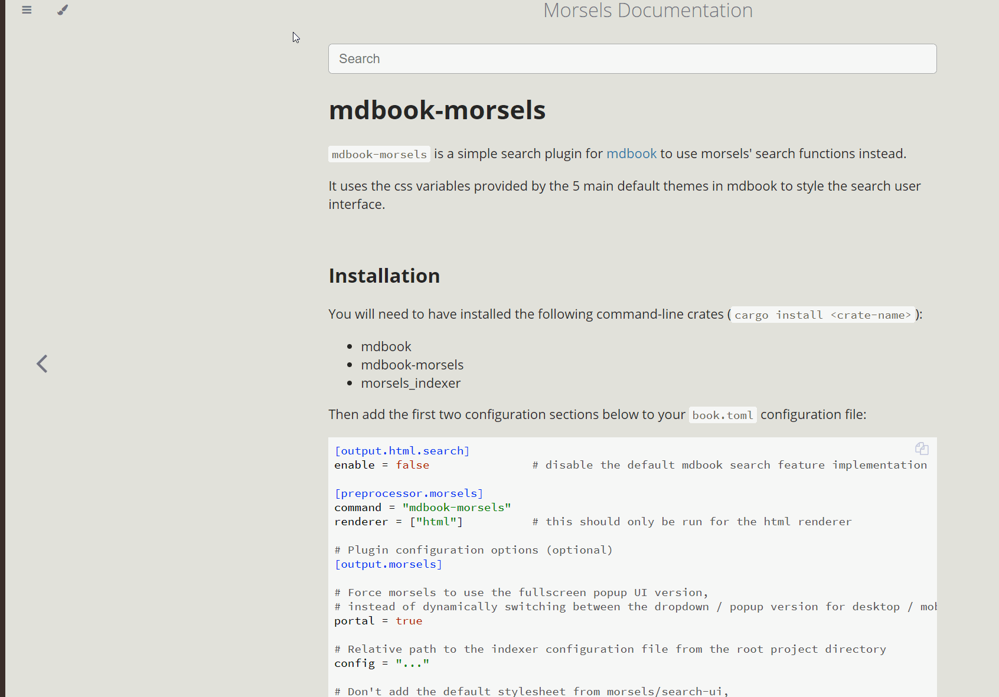

# Morsels.`j/rs` 🧀

A complete and more scalable pre-built index approach to client-side search.

---

## Description

Morsels is a complete **client-side** search solution, including a search **user interface and library** that depends on a **pre-built index** generated by a **command-line build tool**.

The secondary value proposition versus other pre-built index options is **scalability**, achieved mainly by splitting the index into many smaller chunks ("morsels"). This allows the client to **retrieve and load only what is searched**, circumventing network (loading times) & device memory constraints imposed by a monolithic index.

## Features

- Multi-threaded CLI indexer powered by Rust
- WebWorker built-in: no more hanging UI threads!
- Disjunctive expression scoring using BM25
- Standard search features, such as boolean queries and field filters
- Positional search features: phrase queries, and query term proximity boosts
- Powered by WebAssembly, enabling efficient index decompression and query processing 
- Gap and Variable integer compression, giving you more *bang-per-byte*
- Incremental indexing
- Customisable dropdown / fullscreen popup user interface

## Use Cases

The main target use case for this tool right now is providing a complete search solution for static sites (and possibly really, really large ones) or static site generators.

That said, the indexing tool was built with support for a few other file formats (`.json`, `.csv`, `.html`, `.txt`) in mind, and might be useful elsewhere as such.

## Getting Started

Please check out the [docs](http://ang-zeyu.github.io/morsels/)!

## Preview

 

## Faq

### How Scalable is it?

This tool should be able to handle `800MB` **pure text** (not counting things like html soup) collections with the full set of features enabled (numbers [here](https://ang-zeyu.github.io/morsels/tradeoffs.html#limits-of-scalability)).

### What's the Catch?

1. **Latency** & File Bloat

   Scaling this tool for larger collections necessitates fragmenting the index and **retrieving only what's needed** when searched, which means extra network requests (but to a reasonable degree).

   Nevertheless, this tradeoff can also be [configured](https://ang-zeyu.github.io/morsels/tradeoffs.html#tradeoffs) to varying degrees. I.e., morsels can also function much like other monolithic pre-built index options for smaller collections.

2. **Wasm** -- no IE support

3. **Not production ready**

## Contributing

Contributions are highly welcome! Please refer to the [setup guide](http://ang-zeyu.github.io/morsels/contributing.html) to get started.

## License

This project is [MIT licensed](./LICENSE.md).
