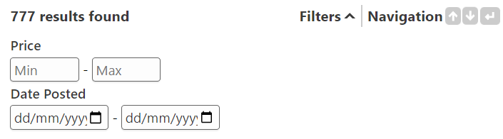

# Filters

## Multi-Select Filters

Multi-select filters, for example the ones you see in this documentation's search ("User Guide", "Advanced"), allow users to filter for results belonging to one or more categories.

For this guide, let's suppose we have a bunch of weather forecast articles and want to support filtering them by the weather (sunny, warm, cloudy).

First, setup a custom [field](./indexer/fields.md) inside the indexer configuration file.

```json
"fields_config": {
  "fields": {
    "weatherField": {
      "storage": [{ "type": "enum" }]
    }
  }
}
```

The `"storage": [{ "type": "enum" }]` option tells InfiSearch that to store the first seen value of this field for each document, but we'll need to tell InfiSearch where the data for this field comes from next.

Let's assume we're dealing with a bunch of HTML weather forecast articles, which uses the [`HTMLLoader`](./indexer/files.md#html-files-loadershtmlloader). In particular, these HTML files store the weather inside a specific element with an `id="weather"`.

```json
"indexing_config": {
  "loaders": {
    "HtmlLoader": {
      "selectors": {
        // Match elements with an id of weather
        "#weather": {
          // And index its contents into our earlier defined field
          // You can also use attributes, see the HTMLLoader documentation
          "field_name": "weatherField"
        }
      }
    }
  }
}
```

Lastly, we need to tell InfiSearch's UI to setup a [multi-select](./search_configuration.md#general-options) filter using this field. To do so, add the following to your `init` call.

```ts
infisearch.init({
  ...
  uiOptions: {
    multiSelectFilters: [
      {
        fieldName: 'weatherField', // matching our earlier defined field
        displayName: 'Weather',
        defaultOptName: 'Probably Sunny!',
        collapsed: true,  // only the first header is initially expanded
      },
      // You can setup more filters as needed following the above procedures
    ]
  }
})
```

The `displayName` option tells the UI how to display the multi-select's header. We simply use an uppercased "Weather" in this case.

Some of the weather forecast articles indexed may also be missing the `id="weather"` element, for example due to a bug in generating the article, and therefore lacks an enum value. InfiSearch internally assigns such documents a default enum value by default. The `defaultOptName` option specifies the name of this default enum value as seen in the UI.

## Numeric Filters

You can also create minimum-maximum numeric filters with InfiSearch. These can be of either `<input type="number|date|datetime-local" />`.



Continuing the same example as multi-select filters, let's suppose we also want to support filtering weather forecast articles by their number of page views. These page views are stored in the `data-pageviews` attribute of the element with an `id="weather"`.

First, we define a signed integer [field](./indexer/fields.md#field-storage).

```json
"fields_config": {
  "fields": {
    "pageViewsField": {
      "storage": [{
        "type": "i64",
        // Default number of page views if there is none
        "default": 0,
        // Parse the data seen as a signed integer
        // Datetimes and floats are also supported, see the above linked documentation
        "parse": { "method": "normal" } 
      }]
    }
  }
}
```

Next, we map the data from the `data-pageviews` attribute into the above field.

```json
"indexing_config": {
  "loaders": {
    "HtmlLoader": {
      "selectors": {
        // Match elements with an id of weather
        "#weather": {
          // And index its data-pageviews attribute into our earlier defined field
          "attr-map": {
            "[data-pageviews]": "pageViewsField"
          }
        }
      }
    }
  }
}
```

Lastly, we tell InfiSearch's UI to setup a [numeric](./search_configuration.md#setting-up-numeric-filters-and-sort-orders) filter using this field. To do so, add the following to your `infisearch.init` call.

```ts
infisearch.init({
  ...
  uiOptions: {
    numericFilters: [
      {
        fieldName: 'pageViewsField',
        displayName: 'Number of Views',
        type: 'number', // date, datetime-local is also supported
        gtePlaceholder: 'Min',
        ltePlaceholder: 'Max',
      }
    ]
  }
})
```
