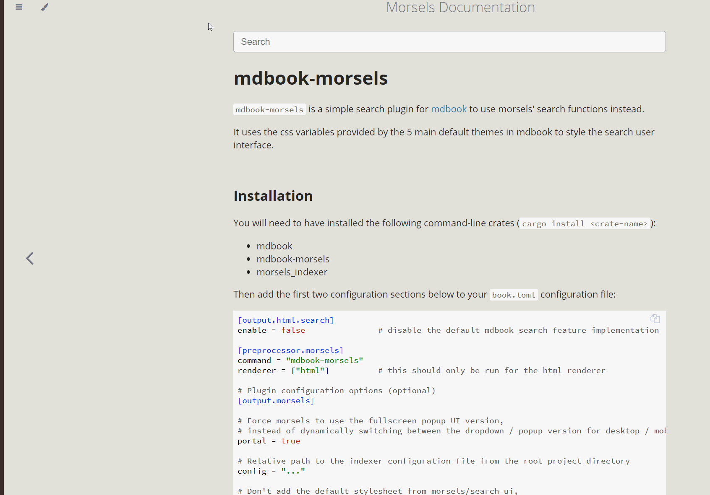

# mdbook-morsels

`mdbook-morsels` is a simple search plugin replacement for [mdbook](https://github.com/rust-lang/mdBook) to use morsels' search interface and library instead of elasticlunr.js.

It uses the css variables provided by the 5 main default themes in mdbook to style the search user interface. You can switch the themes in this documentation to try out the different themes.

Note: The "Morsels" theme is not included in the plugin and is specific to this documentation. It is included only to show the default styling (without mdbook-morsels).

## Installation

You will need to have installed the following command-line crates (`cargo install <crate-name>` or with the binaries in your `PATH`):
- mdbook
- mdbook-morsels
- morsels_indexer

> ⚠️ Ensure the mdbook-morsels and morsels_indexer versions are the same.

Then, minimally add the first two configuration sections below to your `book.toml` configuration file:

```toml
[output.html.search]
enable = false               # disable the default mdbook search feature implementation

[preprocessor.morsels]
command = "mdbook-morsels"
renderer = ["html"]          # this should only be run for the html renderer

# Plugin configuration options (optional)
[output.morsels]

# See search configuration page
mode = "target"

# Relative path to the indexer configuration file from the root project directory
# This will automatically be created if it dosen't exist.
config = "morsels_config.json"

# Don't add the default stylesheet from morsels/search-ui,
# nor the inline css variables for the default mdbook themes
#
# Only needed if you want to use some custom styling
no-css = false
```

## Preview

Use the following (non-canonical, documentation specific) buttons to try out the different [**`mode`** parameters](search_configuration.md#ui-mode).

<style>
    .demo-btn {
        padding: 5px 9px;
        margin: 0 8px 8px 8px;
        border: 2px solid var(--sidebar-bg) !important;
        border-radius: 10px;
        transition: all 0.15s linear;
        color: var(--fg) !important;
        text-decoration: none !important;
        font-weight: 600 !important;
    }

    .demo-btn:hover {
        color: var(--sidebar-fg) !important;
        background: var(--sidebar-bg) !important;
    }

    .demo-btn:active {
        color: var(--sidebar-active) !important;
    }
</style>

<div style="display: flex; justify-content: center; flex-wrap: wrap;">
    <a class="demo-btn" href="?mode=auto">Auto</a>
    <a class="demo-btn" href="?mode=dropdown">Dropdown</a>
    <a class="demo-btn" href="?mode=fullscreen">Fullscreen</a>
    <a class="demo-btn" href="?mode=target">Target</a>
</div>

You can also try out the different **themes** on this documentation using mdbook's paintbrush icon!

<figure>


<figcaption style="text-align: center;"><em>Gif of `mode='fullscreen'` across the different themes</em></figcaption>
</figure>


Also note that unlike the default search feature, the search bar is always there -- there is no search icon on the navbar to click. I am still trying to figure how to add this nicely (without runtime hacks) within mdbook's plugin framework :)
