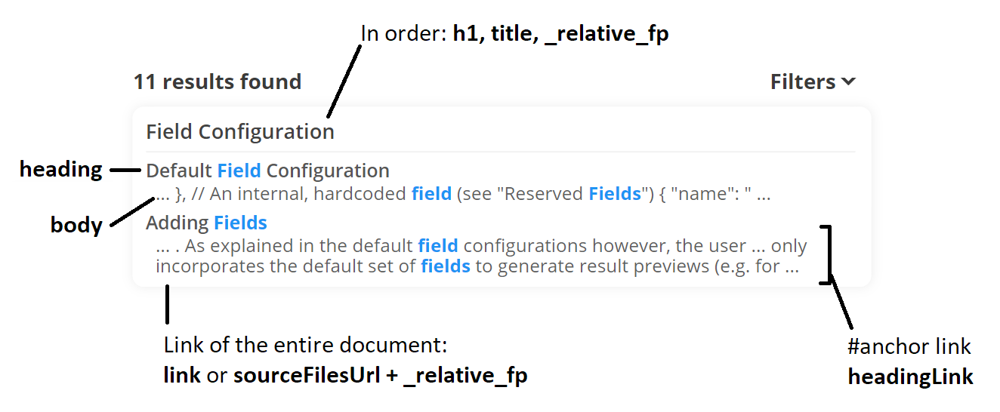

# Field Configuration

Every document you index contains multiple fields. By default, Morsels comes baked in with the configurations needed for supporting static site search, so you don't have to configure what fields are present.

There are a few other parameters mentioned below however, which can be used to adjust caching strategies and the number of generated files. 

## Default Field Configuration

```json
{
  "fields_config": {
    "fields": [
      {
        "name": "title",
        "do_store": true,
        "weight": 2.0, "k": 1.2, "b": 0.15
      },
      {
        "name": "h1",
        "do_store": true,
        "weight": 2.0, "k": 1.2, "b": 0.15
      },
      {
        "name": "heading",
        "do_store": true,
        "weight": 1.5, "k": 1.2, "b": 0.25
      },
      {
        "name": "body",
        "do_store": true,
        "weight": 1.0, "k": 1.2, "b": 0.75
      },
      {
        "name": "headingLink",
        "do_store": true,
        "weight": 0.0, "k": 1.2, "b": 0.75
      },
      {
        "name": "link",
        "do_store": true,
        "weight": 0.0, "k": 1.2, "b": 0.15
      },
      // An internal, hardcoded field (see "Reserved Fields")
      {
        "name": "_relative_fp",
        "do_store": true,
        "weight": 0.0, "k": 1.2, "b": 0.75
      }
    ]
  }
}
```


The functions of the default fields are as follows:



- `h1`, `title`: This is the header for a single document match, sourced from the HTML `<h1>` or `<title>` tags. If unavailable, the `_relative_fp` field is used as a breadcrumb (e.g. `user guide » introduction`).

- `heading`: These are sourced from `<h2-6>` tags. It may contain corresponding highlights from `body` fields that are displayed below it.

  - `headingLink`: These are the corresponding `id` attributes of the heading tags. If available, an `#anchor` is appended to the document's link.

- `_relative_fp`: This field is key for generating the link to the source document (along with the provided `sourceFilesUrl` option) and (optionally) for generating result [previews](../search_configuration.md#default-rendering-output--purpose).

- The `link` field serves to support custom data requirements (e.g. linking to another page, indexing a json document), providing a means to override the default link of `sourceFilesUrl + _relative_fp`.

### Reserved Fields

**`_relative_fp`**

This is a "hardcoded" field generated by the indexer, its value is fixed as the relative path from your source folder to the file.

It is included in the default configuration to facilitate constructing a link to the source file.

**`_add_files`**

This is a field that allows you to **index multiple files** under **a single document** / result, which can be particularly useful for overriding data on a document-by-document basis.

See this [section](./indexing.md#indexing-multiple-files-under-one-document) under indexing for more details on using this.

### Mapping File Data to Fields

Defining fields is all good, but you may also need a way to map custom-formatted file data to each of these fields if the default mappings, which are setup for only HTML files, are insufficient. This is discussed later under [indexing](./indexing.md#mapping-file-data-to-fields-loader_configs).

### Adding Fields (advanced)

You can add your own fields to index as well, which will be factored into Morsels' search algorithms. Note however, that the user interface only incorporates the default set of fields to generate result previews (e.g. for term highlighting). If you need to incorporate additional fields, e.g. a link to an icon, you will need to [alter](../search_configuration_renderers.md#1-rendering-a-single-result) the result renderer.

## Field Specific Parameters

#### Storing Fields: **`do_store`**

Morsels stores fields that have `do_store: true` specified in the field configuration into a json file.
At search time, these fields are retrieved for result preview generation.

#### Field Scoring Parameters

**`weight`**

This parameter is a boost / penalty multiplied to a individual field's score.

Specifying `0.0` will result in the field not being indexed. Meaning, searching for it will not show up any results. The use case for this is to create a field that is only stored using the `do_store` option (e.g. the `_relative_fp` field).

**`k` & `b`**

These are Okapi BM25 model parameters. The following [article](https://www.elastic.co/guide/en/elasticsearch/guide/current/pluggable-similarites.html#bm25-tunability) provides a good overview on how to configure these if the defaults are unsuitable for your use case.


## Miscellaneous Parameters (advanced)

> ⚠️ The parameters below allow you to adjust caching strategies, and the number of generated files. However, you should mostly be well-served by the preconfigured [scaling presets](./larger_collections.md) for such purposes.

```json
{
  "fields_config": {
    "cache_all_field_stores": true,
    "field_store_block_size": 100000000,
    "num_stores_per_dir": 1000,
  }
}
```

#### Field Store Granularity: **`field_store_block_size`, `num_stores_per_dir`**

The `field_store_block_size` parameter controls how many documents to store in one json file. Batching multiple files together if the fields stored are small can lead to less files and better browser caching. The `num_stores_per_dir` parameter controls how many json files should be stored together in one directory.

> ⚠️ Ensure `field_store_block_size` is a clean multiple or divisor of the `num_docs_per_block` parameter under [indexing](./indexing.md).<br>
> This is a rather arbitiary limitation chosen to reduce the field store indexing scheme complexity,
> but should work well enough for most use cases.

#### Field Store Caching: **`cache_all_field_stores`**

This is the same option as the one under [search functionality options](../search_configuration.md#search-functionality-options).
If both are specified, the value specified in the `initMorsels` call will take priority.

All fields specified with `do_store=true` would be cached up front on initialisation of the search library.

Its usage alongside other options is discussed in more detail under the chapter [Larger Collections](larger_collections.md).
