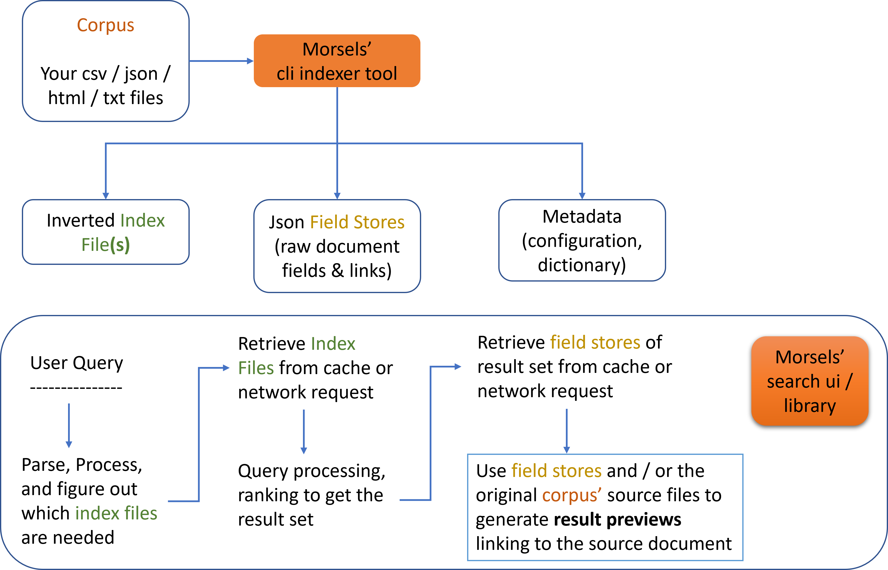

# Introduction

Morsels is a complete **client-side** search solution, including a search **user interface and library** that depends on a **pre-built index** generated by a **command-line build tool**.

The secondary value proposition versus other pre-built index alternatives is the option of scalability, achieved mainly by splitting the index into many smaller chunks ("morsels"). This allows the client to retrieve and load only what is searched, circumventing network (loading times) & device memory constraints imposed by a monolithic index.

## Features

- Multi-threaded CLI indexer powered by Rust

- Various search features, such as boolean queries, field filters, phrase queries, BM25 scoring, query term proximity boosts and WebWorker built-in

- Powered by WebAssembly, enabling efficient index decompression and query processing 

- Gap and Variable integer compression, giving you more *bang-per-byte*

- Incremental Indexing

- Customisable dropdown / fullscreen popup user interface

## How it Works

The following diagram summarises how Morsels works:

## Use Cases

You may want to use this tool if:
- You want a **complete, end-to-end** and customisable search UI and **cli-based file indexing** solution (perfect for static site generators!)
- You have a fairly **large collection** of html, csv, json or txt (only these are supported for now) files that cannot be monolithically retrieved or kept in memory feasibly
- Running a search server / SaaS (eg. Algolia Docsearch) is not an option

> ⚠️ 
> It is **not possible** to use morsels for **client-side indexing** as such since the indexer is a cli tool.
>
> If this is the use case, consider other lighter-weight libraries like lunr.js that already fit well.

## Libraries

This project is currently made up of 1 exposed crate and npm package, which may be referred to in the subsequent sections of the documentation.

#### Exposed Crates and Packages:
- **morsels_indexer**: the cli tool providing indexing functionalities for several file formats
- **@morsels/search-ui**: interfaces with @morsels/search-lib to provide basic search UI functionalities (e.g. result preview generation)

#### Internal Crates and Packages:
- **morsels_search**: internal rust wasm crate, used by the **@morsels/search-lib** package below.
- **morsels_common**: internal rust crate containing some common functionalities
- **@morsels/search-lib**: a small companion library to morsels_search for interfacing with the wasm crate. This may be used without the `@morsels/search-ui` package in the future. For now, it only serves to separate some concerns from the UI package
- **@morsels/lang-XX**: internal tokenizer packages for different languages generated by wasm pack

## Other Limitations

- The project uses WebAssembly. If IE support is needed, you'll have to look elsewhere =(
- For now, the focus is on providing e2e search functionalities in the **browser**. That means no Node.js support and such.
