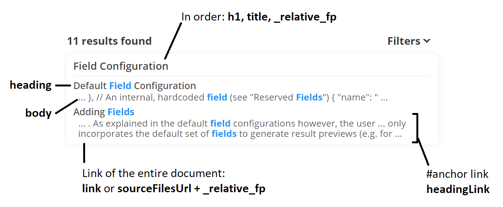

# Search Configuration

All search related options can be provided through the `initMorsels` function, exposed by the search bundle.

There are 2 categories of options, the first being related to internal search library functionalities, and the second the user interface.

---

## Forenote on Mobile Device Detection

Note that some options in both the search library and UI are (by default) tuned based on whether the client is a "mobile device":
- Query term proximity ranking is disabled
- The fullscreen version of the user interface is used for `mode='auto'` (see [UI Mode](#ui-mode))

Overrides and the process of this detection is configurable, and will be covered later.

---

## Search UI Options

Search UI options are organised under the `uiOptions` key:

```ts
initMorsels({
    uiOptions: {
        // ... options go here ...
    }
})
```

For brevity, this page covers only a subset of the most important options.

The subsequent [sub-chapter](./search_configuration_renderers.md) provides a few more APIs to customise the HTML output. If you have a configuration use case that cannot be achieved without these APIs, and you think should be included as a simpler configuration option here, feel free to raise a feature request!

### Input Element

| Option      | Default Value | Description |
| ----------- | ----------- | ----------- |
| `input`     | `'morsels-search'` | `id` of the input element or a HTML element reference |
| `inputDebounce`     | `100` | debounce time of keystrokes to the input element |
| `preprocessQuery`   | `(q) => q` | any function for preprocessing the query. Can be used to add a [field filter](./search_features.md#field-search) for example. |

The `input` element is the most important option, and is required in most cases. Its purpose varies depending on the `mode` specified below.

### UI Mode

`mode = 'auto'`

The search UI provides 4 main different behaviours.

To **try the different modes out**, head on over to the [mdbook plugin](./getting_started_mdbook.md#preview) page, which provides various buttons for switching the modes in this documentation!


| Mode        | Details |
| ----------- | ----------- |
| `"auto"`        | This option is the **default**, and combines the `dropdown` and `fullscreen` options below. If a mobile device is detected as per the [earlier section](#forenote-on-mobile-device-detection), the `fullscreen` mode is used. Otherwise, the `dropdown` mode is used.<br><br>An event handler is also attached that reruns this adjustment whenever the window is resized.   |
| `"dropdown"`    | This wraps the specified `input` element with a root container. Search results are placed in a `<ul>` container next to the input element.    |
| `"fullscreen"`  | This option creates a completely distinct root container (complete with its own input element, backdrop, close button, ...), and attaches it to the `<body>` element.<br><br>Under the default stylesheet, the user interface is fullscreen under `max-width: 1025px`, and takes up roughly 50% of the screen estate otherwise.<br><br>If the `input` element is specified, the interface is also shown whenever the `input` is focused. For keyboard accessibility, some minimal, but overidable [styling](./search_configuration_styling.md#input-element) is applied to the input element in this case.<br><br>Alternatively, the `showFullscreen` and `hideFullscreen` functions returned by the `initMorsels` call can be used to toggle the UI programatically. This is also *the only use case you would not need to specify the `input` element*.    |
| `"target"`      | This option is the most flexible, and is used by the mdbook plugin (by default) and this documentation. The `input` element must be specified, where keystroke event listeners are attached. No dom manipulation is performed unlike the `dropdown` or `auto` modes.<br><br>The search results are output to a custom `target` element of choice.    |


#### UI Mode Specific Options

There are also several options specific to each mode. Note that `dropdown` and `fullscreen` options are both applicable to the `auto` mode.

| Mode        | Option                | Default                 | Description |
| ----------- | -----------           | -----------             | ----------- |
| `auto`         | `fsInputButtonText`        | `undefined`| Placeholder override when the fullscreen UI is in use (i.e. when the input functions like a button). By default, Morsels uses the original placeholder you've configured, but makes some minimal [styling](./search_configuration_styling.md#input-element-as-a-button) changes to ensure keyboard accessibility.
| `dropdown`  | `dropdownAlignment`   | `'bottom-end'`          | `'bottom'` or `'bottom-start'` or `'bottom-end'`.<br><br>This is the side of the input element to align the dropdown results container and dropdown seperator against.<br><br>The alignment of the dropdown container will also be automatically flipped horizontally to ensure the most optimal placement (see [floating-ui's](https://floating-ui.com/docs/size#using-with-flip) docs for a demonstration).
| `fullscreen` | `fsInputLabel`        | `'Search'` | Accessibility label for the original input element, when the fullscreen UI is in use.
| `fullscreen` | `fsContainer`         | `<body>` element        | `id` of the element, or an element reference to attach the separate root container to.
| `fullscreen` | `fsPlaceholder`       | `'Search this site...'` | Placeholder of the input element in the fullscreen UI.
| all except `target`         | `tip`                 | `true`        | Whether to show the tip icon. When hovered over, this shows advanced usage information (e.g. how to perform phrase queries).
| `target`    | `target`              | `undefined`                       | `id` of the element, or an element reference to attach results to.<br><br>Required if using `mode='target'`.

#### General Options

| Mode        | Option                | Default                 | Description |
| ----------- | -----------           | -----------             | ----------- |
| all         | `label`               | `'Search this site'`    | Accessibility label for the fullscreen UI input.
| all         | `resultsLabel`        | `'Site results'`        | Accessibility label for result `listbox`es.

#### Manually Showing / Hiding the Fullscreen UI

```ts
const { showFullscreen, hideFullscreen } = initMorsels({ ... });
```

You may call the `showFullscreen()` function returned by the initMorsels call to programatically show the fullscreen search UI.

Correspondingly, the `hideFullscreen()` method hides the fullscreen interface, although, this shouldn't be needed since a close button is available by default (the <kbd>Esc</kbd> key works too).

These methods can also be used under `mode="auto"`.


### Options for Generating Result Previews

There are 3 ways to generate result previews of matched documents, the second being the default.

Unless you have modified the default result renderer (covered in the next page on renderers), morsels also requires **at least one** of the `body` / `heading` / `title` fields. This is configured by default, and covered in the next section on indexing configuration in more detail.


#### Default Rendering Output / Purpose

The default use case / result generation assumes the simple but common use case of linking to a source document (via an `<a>` tag). 

Therefore, source documents are assumed to be **available** and **linkable** to. The url of this source document is **either**:
1. The `sourceFilesUrl` option concatenated with the relative file path of the document at the time of indexing **(default)**.

   > The relative file path is stored in the `_relative_fp` field, which is an internally generated field. Combining this with the base url (`sourceFilesUrl`) forms the full source document link.
1. The [`link` field](./indexer/fields.md#default-field-configuration), a custom field that has to manually mapped from file data.

The use of the default indexed fields in the UI is as shown in the following diagram, and will be covered in more detail in the chapter on [fields](./indexer/fields.md):



Some indexer configuration [presets](./indexer/presets.md) are available to help with switching between options 1 and 2 easily.

#### 1. From Source Documents

When option 2 below (field stores) is not configured or unavailable, morsels will attempt to *retrieve and reparse the source document and its fields* in order to generate result previews.

Note that this option is only applicable for indexed HTML, json, and txt files at this time.

As csv files are often used to hold multiple documents (and can therefore get very large), it is unsuitable to be used as a source for search result previews. In this case, options 2 or 3 can be used.

#### 2. From Field Stores (default)

Morsels is also able to generate result previews from its own json field stores generated at indexing time.

In order to specify what fields to store, and how to map file data to these fields, refer to the chapter on [fields](./indexer/fields.md) under indexer configuration.

You may also wish to use this method even if source documents are available, if filesystem bloat isn't too much of a concern. Apart from avoiding the additional http requests, the internal json field store comes packed in a format that is more performant to perform result preview generation on.

#### 3. Alternative Rendering Outputs (advanced)

It is also possible to create your own result [renderer](./search_configuration_renderers.md) to, for example:
- attach an event handler to call a function when a user clicks the result preview
- retrieve and generate result previews from some other API.

Nevertheless, the section ["From Field Stores"](#from-field-stores) above would still be relevant as it provides the basis for retrieving a document's fields (e.g. a document id with which to call an API).

This is covered in more detail in the next page.

### Results Per Page

`resultsPerPage = 8`

In all UI modes, an infinite scrolling intersection observer is attached to the last search result. When triggered, search result previews are fetched and generated for a number of results only.

Lowering this value can have a noticeable performance improvement on result generation, as more `.html / .json` files have to be retrieved on-the-fly, parsed, and processed. This is especially true if using option 1 above.

### Changing The Mobile Device Detection Method

The mobile device check is done through a simple `window.matchMedia('only screen and (max-width: 1024px)').matches` query at initialisation time, which may not be robust enough for your use case.
 
An override may be provided through the `isMobileDevice` option shown below, which is simply a function returning a boolean.

```ts
initMorsels({
    isMobileDevice: () => true,
})
```

---

## Search Library Options

The options for the search library are rather brief, and can be summarised in this snippet:

```js
initMorsels({
    // Options belonging to @morsels/search-lib, the search library package
    searcherOptions: {
        // Base url of output directory that the cli tool generated
        url: 'http://192.168.10.132:3000/output/',
        
        // Maximum number of terms for query term expansion
        numberOfExpandedTerms: 3,
        
        // Override for using query term proximity ranking or not.
        // Disabled for mobile devices by default
        useQueryTermProximity: true,

        // Whether to retrieve all field stores on initialisation
        // (see chapter "Tradeoffs" for more details)
        cacheAllFieldStores: true,

        // The maximum number of results to retrieve (unlimited if null).
        resultLimit: null,
    },
});
```

### Automatic Term Expansion

`numberOfExpandedTerms`

Stemming is turned off in the default [language module](./indexer/language.md#ascii-tokenizer). This does mean a bigger dictionary (but not too much usually), and lower recall, but much more precise searches.

To provide a compromise for recall, query terms that are similar to the searched term are added to the query, although with a lower weight.

For all [language modules](./indexer/language.md) available currently, this is only applied for the last query term, and if the query string does not end with a whitespace. An implicit wildcard (suffix) search is performed on this term. (similar to Algolia Docsearch's behaviour)

### Term Proximity Ranking

`useQueryTermProximity`

If positions are indexed, document scores are also scaled by how close query expressions or terms are to each other.
This may be costly for mobile devices however, and is disabled by default in such cases.
