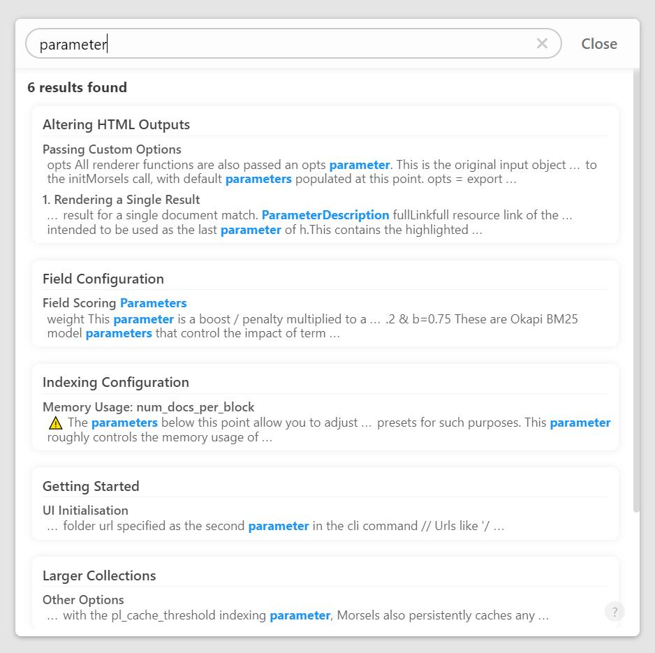
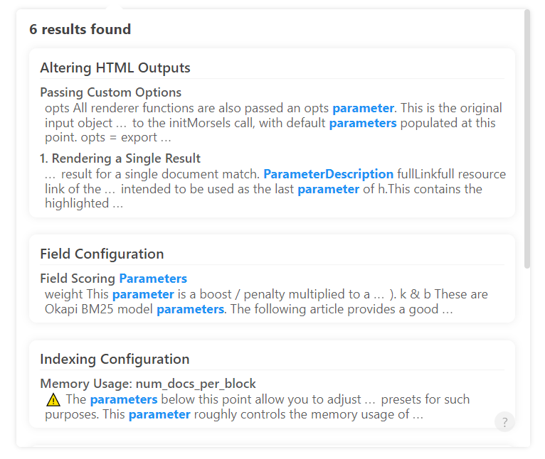
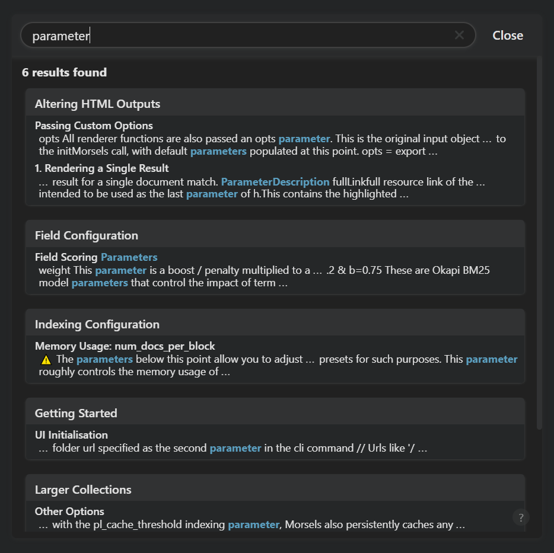
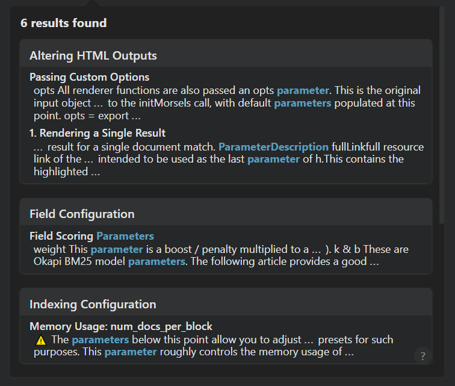

# Styling

## Themes

Morsels provides 2 built-in themes by default, which correspond to the 2 stylesheets in the [releases](https://github.com/ang-zeyu/morsels/releases).

These 2 stylesheets also expose a wide range of css variables which you can alter as needed.

Head on over to the demo site [here](https://ang-zeyu.github.io/morsels-demo-1/) to try them out!

### Light

#### CDN link

```html
<!-- Replace "v0.1.1" as appropriate -->
<link rel="stylesheet" href="https://cdn.jsdelivr.net/gh/ang-zeyu/morsels@v0.1.1/packages/search-ui/dist/search-ui-light.css" />
```

#### Preview

<style>
.image-container {
    display: flex;
    align-items: center;
    flex-wrap: wrap;
    justify-content: center;
}

@media screen and (max-width: 1129px) {
    .image-container > img:first-child {
        margin-bottom: 10px;
        min-width: 300px;
        max-width: 500px;
    }

    .image-container > img:last-child {
        width: 300px;
    }
}

@media screen and (min-width: 1130px) {
    .image-container > img:first-child {
        margin-right: 10px;
        height: 440px;
    }

    .image-container > img:last-child {
        height: 440px;
    }
}
</style>

<div class="image-container">


</div>

### Dark

#### CDN link

```html
<!-- Replace "v0.1.1" as appropriate -->
<link rel="stylesheet" href="https://cdn.jsdelivr.net/gh/ang-zeyu/morsels@v0.1.1/packages/search-ui/dist/search-ui-dark.css" />
```

#### Preview

<div class="image-container">


</div>

## Input Element As a Button

Where the `input` option passed to `initMorsels` is concerned, Morsels adopts a minimally invasive approach to styling, preferring to leave this to the individual site's preferences.

For accessbility reasons however, some minimal styling is applied when the using the fullscreen UI version to convey the intention of a button. This is limited to only an `outline`, `cursor: pointer`, and `text-align: center` (for the placeholder) application.

Accessibility labels and roles are automatically set however, so you needn't worry about those.

You may override and addon to these styles as needed, using the `.morsels-button-input` selector. For example,

```css
.morsels-button-input:focus,
.morsels-button-input:hover {
    background: orange;
}
```
