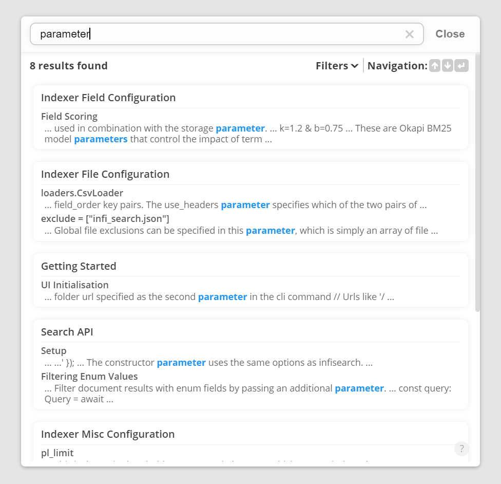
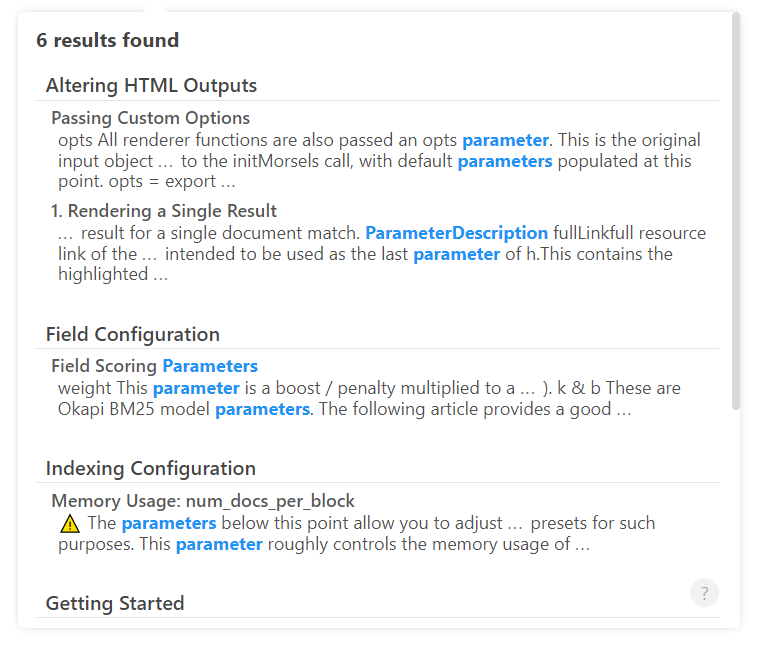

# Styling

<style>
.image-container {
    display: flex;
    flex-direction: column;
    align-items: center;
    justify-content: center;
}

.image-container > img {
    margin-top: 10px;
    width: 500px;
    max-width: 100%;
}
</style>

## Themes

Morsels provides 3 built-in themes by default, which correspond to the 3 stylesheets in the [releases](https://github.com/ang-zeyu/morsels/releases).

These 3 stylesheets also expose a wide range of css variables which you can alter as needed.

Head on over to the demo site [here](https://morsels-search.com) to try them out!


### Light

#### CDN link

```html
<!-- Replace "v0.5.0" as appropriate -->
<link rel="stylesheet" href="https://cdn.jsdelivr.net/gh/ang-zeyu/morsels@v0.5.0/packages/search-ui/dist/search-ui-light.css" />
```

#### Preview

<div class="image-container">


</div>


### Basic

#### CDN link

```html
<!-- Replace "v0.5.0" as appropriate -->
<link rel="stylesheet" href="https://cdn.jsdelivr.net/gh/ang-zeyu/morsels@v0.5.0/packages/search-ui/dist/search-ui-basic.css" />
```

<div class="image-container">


</div>

### Dark

#### CDN link

```html
<!-- Replace "v0.5.0" as appropriate -->
<link rel="stylesheet" href="https://cdn.jsdelivr.net/gh/ang-zeyu/morsels@v0.5.0/packages/search-ui/dist/search-ui-dark.css" />
```

#### Preview

<div class="image-container">


</div>

## Styling the Fullscreen UI Input Button

Morsels adopts a minimally invasive approach to styling your `<input>` element (except for the one that comes with the fullscreen UI), leaving this to your individual site's styling.

For accessibility, however, some minimal styling is applied when using the [fullscreen UI](./search_configuration.md#ui-mode) to convey the intention of a button (which opens the fullscreen UI). This is limited to:
- A `background` & `box-shadow` & `color` application on *focus*

  These are applied with a `!important` modifier as they are key to conveying keyboard focus, but are also overridable easily with Morsels' css variables.
- `cursor: pointer` application on *hover*

Accessibility labels and roles are also automatically set.

**Applying Input Button Styles under `mode='auto'`**

If using the default [UI mode](./search_configuration.md#ui-mode) of `auto`, which switches between the dropdown and fullscreen UI dynamically, you can also set a different [placeholder](./search_configuration.md#ui-mode-specific-options), and/or use the `.morsels-button-input` selector to apply your styles only if the fullscreen UI is used. For example,

```css
.morsels-button-input:focus:not(:hover) {
    background: #6c757d !important;
}
```
